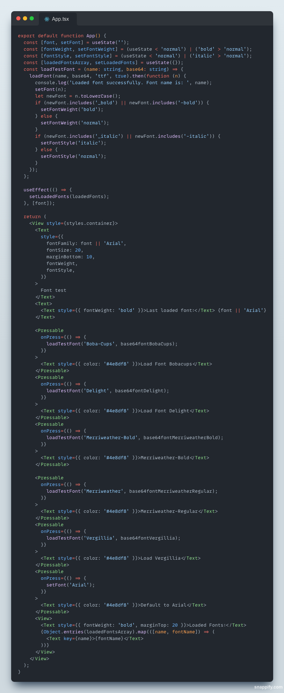

# @vitrion/react-native-load-fonts

A powerful and flexible library that allows you to load fonts dynamically at runtime via base64 encoded TTF or OTF on your React Native application.

[](https://www.npmjs.com/package/\@vitrion/react-native-load-fonts)
[](https://npmjs.org/package/\@vitrion/react-native-load-fonts)
[](https://www.npmjs.com/package/@vitrion/react-native-load-fonts)
[](https://github.com/vitrionbv/react-native-load-fonts/issues)
[](https://github.com/vitrionbv/react-native-load-fonts/pulls)
[](https://github.com/vitrionbv/react-native-load-fonts/pulls)
[](https://github.com/vitrionbv/react-native-load-fonts)
[](https://www.npmjs.com/package/typescript)
[](https://github.com/vitrionbv/react-native-load-fonts/network/members)

## Screenshots

|             iOS              |                         Android                          |
|:----------------------------:|:--------------------------------------------------------:|
|  |  |

## Features

- Load fonts dynamically at runtime
- Support for TTF and OTF font formats
- Base64 encoded fonts
- Built with TypeScript

## Installation

Install the package in your React Native project:

```
npm install @vitrion/react-native-load-fonts
```

## Usage
To load a font dynamically, you must first have a base64 string of your font file (TTF or OTF):
```javascript
import { loadFont, loadFonts, loadedFonts } from '@vitrion/react-native-load-fonts';

/* Load a single font */
loadFont('nameOfFont', base64FontString, 'ttf').then(function(name) {
	console.log('Loaded font successfully. Font name is: ', name);
});

/* Load a list of fonts */
loadFonts([{name: 'nameOfFont', data: base64FontString, type: 'ttf'}]).then(function(names) {
	console.log('Loaded all fonts successfully. Font names are: ', names);
});

console.log('Loaded fonts are: ', loadedFonts);
/* Be carefull this is not reactive, */

```

#### Font loading using file path
You can download font file to file system and then load it to app without sending base64 to bridge.

```javascript
import { loadFontFromFile } from '@vitrion/react-native-load-fonts';
import RNFetchBlob from 'rn-fetch-blob'

const fontFilePath = RNFetchBlob.fs.dirs.DocumentDir + "fonts/roboto.ttf";

loadFontFromFile("Roboto",  fontFilePath)
   .then(function(name) {
   	    console.log('Loaded font successfully. Font name is: ', name);
   });

```

More examples can be found in the [example](https://github.com/vitrionbv/react-native-load-fonts/tree/main/example) directory of the repository.



## Functions

### `loadFont(name, data, type)`

### Options

| Option | iOS      | Android | Info                                                                                                                                                                                                                                                             |
|--------|----------|---------|------------------------------------------------------------------------------------------------------------------------------------------------------------------------------------------------------------------------------------------------------------------|
| name   | Not used | Used    | The name to be assigned to the loaded font. This parameter is used on Android to specify the registered font name (it doesn't work for iOS).                                                                                                                     |
| data   | Used     | Used    | The base64 string representation of the font file (TTF or OTF). It can be a data URI or raw base64. If it is raw base64, the `type` must be specified, but it defaults to TTF if not provided. The data URI should have a mime type of `font/ttf` or `font/otf`. |
| type   | Used     | Used    | (string, optional): Specifies the type of font in the encoded data. It should be either `'ttf'` or `'otf'`. Defaults to `'ttf'`.                                                                                                                                 |

### The Response

The actual name the font was registered with. Use this name for your `fontFamily`.

#### <span style="color:#ff0000">Notes</span>

- **Note for iOS:** On iOS, it is not possible to explicitly specify the font name when loading fonts dynamically. As a result, both Android and iOS platforms will return the actual registered font name. For Android, this will be whatever you pass in, but for iOS, it will be the name embedded within the font file. To avoid any potential issues, it is recommended to always use the full font name embedded in the font file.

- **Ensuring Proper Display:** It's important to note that the dynamically loaded font will only be displayed correctly if you provide the appropriate `fontWeight` and `fontStyle` values when applying the font. Be sure to refer to the provided [example](https://github.com/vitrionbv/react-native-load-fonts/tree/main/example) for guidance on using the correct font weight and font style configurations.

## Contributing

See the [contributing guide](https://github.com/vitrionbv/react-native-load-fonts/blob/main/CONTRIBUTING.md) to learn how to contribute to the repository and the development workflow.

## License

MIT
